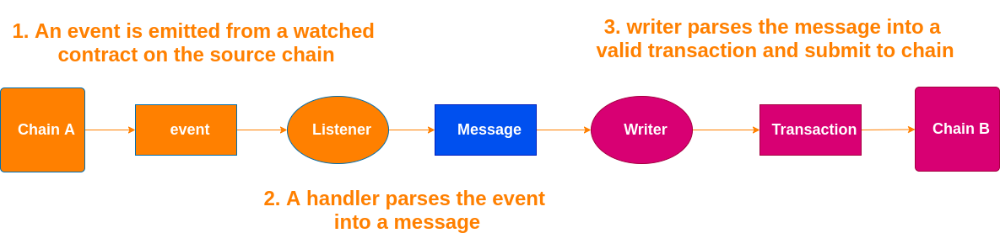

# Platdot

English | [简体中文](./docs/README_CN.md)

​       

[communicate with us](https://matrix.to/#/#platdot:matrix.org?via=matrix.org)

## A cross-chain Bridge

`Platdot` is a cross-chain bridge developed based on [ChainBridge](https://github.com/ChainSafe/ChainBridge), it provides `Polkadot` cross-chain bridge for `Platon` to achieve the functions of PDOT **issuance**, **redemption** and **transfer**. Currently, Platdot supports cross-chain transfer of assets between EVM and substrate chains that support multisig-pallet, such as polkadot / kusama. EVM's smart contract, as one end of the bridge, allows custom processing behavior when the transaction is received. For example, locking DOT assets on the polkadot network and executing contracts on EVM can mint and issue PDOT assets, similarly, executing contracts on EVM can destroy PDOT assets and redeem DOT assets from Polkadot's multi-signature address. Platodt currently operates under a trusted federation model, and users can complete mortgage issuance and redemption operations at a very low handling fee.

It is now in the testing phase and has realized the KSM and AKSM circulation of Kusama network and Alaya network.

## Installation

### Prerequisites

+ Make sure the `Go` environment is installed

### Building

`git clone https://github.com/RJman-self/Platdot.git`

`make build`: Builds `platdot` in `./build`.

**or**

`make install`: Uses `go install` to add `platdot` to your `GOBIN`.

## Getting Start

Documentations are now moved to `GitHub Wiki`.

[Start Platdot as a relayer](https://github.com/RJman-self/Platdot/wiki/Start-Platdot-as-a-relayer)

## License

The project is released under the terms of the `GPLv3`.
